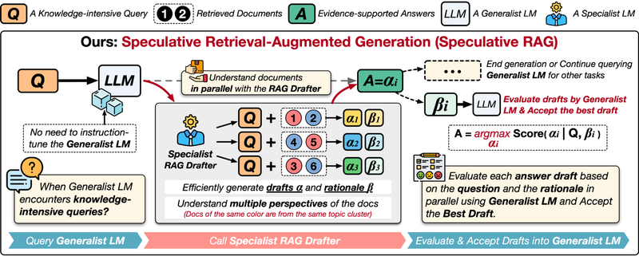

# Speculative RAG

The authors of this approach describe Speculative RAG as a novel Retrieval Augmented Generation framework. It utilizes a smaller specialist LM to generate draft texts, which are then fed to a larger generalist LM for verification and selection of the best draft. Speculative RAG achieves state-of-the-art performance in terms of both accuracy and efficiency.

You can find more information about this approach in the author's material [here](https://research.google/blog/speculative-rag-enhancing-retrieval-augmented-generation-through-drafting/).

In this project, I have implemented the Speculative RAG framework using the OpenAI Python SDK. I have closely followed the original paper, although some workarounds were necessary due to the way OpenAI API's work. Additionally, I have demonstrated how to use this approach in an Agent-like application using LangGraph.

Here are the notebooks included in this project:

| Notebook Name                  | Description                                                                                           |
|-------------------------------|-------------------------------------------------------------------------------------------------------|
| `speculative_rag.ipynb`         | This notebook contains the implementation of Speculative RAG using OpenAI Python SDK.                            |
| `langgraph_speculative_rag.ipynb` | This notebook utilizes the previous implementation and constructs a LangGraph agent capable of utilizing Speculative RAG as a tool. |

